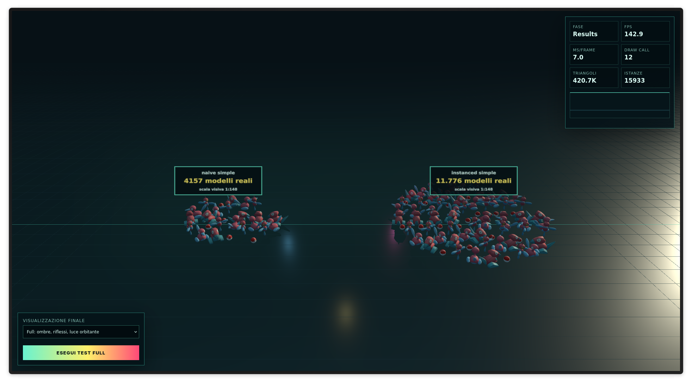

# Porygon-Z Benchmark — Computer Graphics (Modulo 2)

Benchmark grafico interattivo realizzato in **Three.js r160** (moduli ES6 nativi) per il corso di Computer Graphics (A.A. 2025/2026). 

Il progetto analizza in tempo reale le prestazioni del rendering standard a scene graph (**naive**) a confronto con il GPU instancing tramite **`THREE.InstancedMesh`**, determinando in modo adattivo il carico massimo di modelli sostenibili sopra il target configurato di 30 FPS.

### 🔗 Live Demo
Il progetto è accessibile direttamente online via GitHub Pages:  
👉 **[https://gregoriocavulla.github.io/ComputerGraphics_AA2025-2026_Modulo2/](https://gregoriocavulla.github.io/ComputerGraphics_AA2025-2026_Modulo2/)**

---

---

### Caratteristiche principali

* **Asset ottimizzati:** pipeline in Blender con unificazione della mesh, rimozione dello scheletro e atlas delle texture per la famiglia Porygon e la Pokéball.
* **Ricerca adattiva del limite:** incremento moltiplicativo del carico e restringimento dell'intervallo dopo la prima instabilità, usando media FPS e decimo percentile.
* **Scala dinamica dell'HUD:** stima del refresh rate effettivo tramite `requestAnimationFrame` per dimensionare il grafico FPS.
* **Profili grafici:** profilo *simple* con ombre disattivate e materiali `MeshBasicMaterial`, e profilo *full* con materiali PBR, ombre dinamiche, riflessi e luce orbitante.
* **Pile di risultati 3D:** visualizzazione finale a colonne dei massimi registrati.
* **Zero build step:** funzionamento statico nativo senza bundler o installazioni.

---

### How to use

Apri il progetto e premi **Avvia benchmark** nella schermata iniziale. Durante il test, l'HUD in alto a destra mostra le metriche di rendering. Al termine, usa il selettore in basso a sinistra per scegliere la visualizzazione delle pile e il pulsante **Esegui test full** per avviare il secondo benchmark con luci e ombre.

---

### Struttura della repository

* `index.html` — Landing page con selezione rapida tra progetto e documentazione.
* `project/` — Benchmark 3D e visualizzatore interattivo.
* `doc/` — Documentazione tecnica approfondita sulla pipeline e sull'architettura.